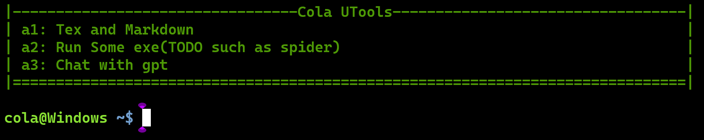
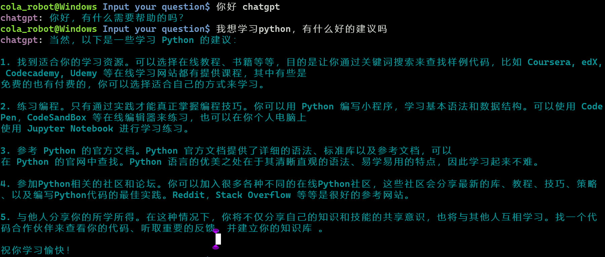
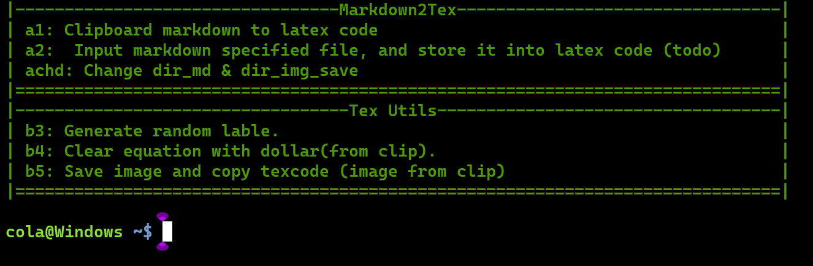
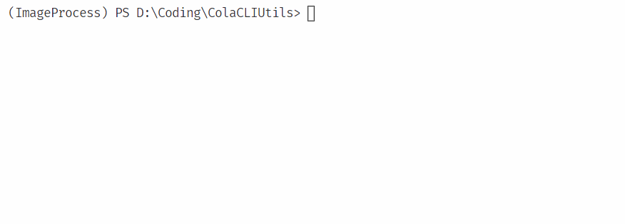

CLI Utils for me, and you can DIY yours utools easyly via core module.

NOTE: 请阅读2023年4月29日及之后的内容

# CLI(up to 2023年4月29日)

**主界面**



**GPT聊天**



**Latex与Markdown的工具库**




# 日志(up to 2023年5月16日)
## 2023年5月16日
- 添加了默认应用打开方式，格式为
```yaml
      default:
        - "Paht to your file without space "
```
- 添加了网页打开方式，关键词是web
```yaml
      web:
        - "www.bing.com"
```
## 2023年5月5日
- 添加打开配置文件的函数的命令(不必在文件夹中寻找配置文件)
- 修改markdown的图片路劲解析(普通方法、html插入方法都可以解析)
## 2023年4月29日
- 添加日志会话功能，根据配置dak
- 将参数存储为yaml格式
- 从命令行输入时 `$cut` 命令能删除掉前面的所有文字
- is_page_dif_prefix变量控制是否加上字母前缀
- python的惰性导入技术 -> 加快程序启动速度
- chatgpt的对话日志使用markdown语法 -> 方便后期查看、整理，并且以每一天为单独的日志文件
- 修改输入输出io的显示方法，使用`ColaCMDIO`来控制输入输出格式
- 修改整个项目的结构，具体说明如下：
  - core: 即CMDMenu相关的模块，具体来说`ColaCMDMenuItem`是每一个选项集合的抽象，被称为menu，`MenuItemSet`是多个menu构成的集合，被称为page
  - plugins: 就是为了实现不同的功能、page而分文件夹写的
    - ChatPGT: chatgpt相关代码
    - TexMD: latex与markdown转换相关代码
  - main.py: 作为入口page
- 添加使用说明书及其案例

## 2023年4月28日
- 加入ChatGPT的选项，用户需要在config.yaml中写入以下内容
  - api key 会失效！ 需要进入 [web](https://platform.openai.com/account/api-keys) 重新申请!
``` yaml
api_key: <Your API Key>
```
- 加入多层目录，顶层为`MainPageMenu`控制，其可以理解为一个文件夹，下面可以存放很多文件(对应于多个menu)，然后可以递归调用其余目录
  - 每一个目录都是一个`MenuItemSet`: 即由多个目录构成的集合
  - 每次构造一个目录时，需要继承于`MenuItemSet`，然后调用`add_menu`添加选项(TODO: 添加选项的语法)(可以调用多次), 然后需要重新实现`runloop`函数，其内部是while循环，不断读取键盘输入，然后作出对应响应

# TODO
- [ ] 详细说明每一个page的使用手册 or -> 直接写成字符串，然后`help`命令打印出来吧！


# 使用说明(quick start)
## 创建自己的模块
**结果展示**



下面给出具体代码

**第一步: 先import core**

```python
import core
```

**第二步: 创建一个MyPage类，其继承自MenuItemSet**

```


class MyPage(core.MenuItemSet):
    def __init__(self, username="cola") -> None:
        super().__init__(username)
```

**第三步：写自己想要调用的函数**

```
class MyPage(core.MenuItemSet):
    def __init__(self, username="cola") -> None:
        super().__init__(username)


    def _keyfunc_first(self):
        print("keyfunc_fist")

    def _keyfunc_second(self):
        print("keyfunc_second")
    
```

**第四步: 添加菜单选项** 通过add_menuKeyFunc函数添加菜单选项，其参数解释如下：

- `add_menuAkeyfunc(self, name, **cmd_dict)`
  - name: 菜单名
  - cmd_dict: 即一个字典，key是用户要输入的命令，value由长度为2的list组成，第一个元素是字符串用于描述该选项功能，第二个元素是函数，对应于执行的函数，下面的代码的menu1通过kwargs来实现，第二种通过dict来实现，由于接口是通过**实现的，所以dict需要加上\*\*才能传入
    - **注意** 若key是数字则需要加上`_`，后续会自动检测将其剔除

```python


class MyPage(core.MenuItemSet):
    def __init__(self, username="cola") -> None:
        super().__init__(username)

        # menu 1
        self.add_menuAkeyfunc(
            name="First Menu", 
            _1=["first choose", self._keyfunc_first], 
            _2=["second choose", self._keyfunc_second]
        ) 
        
        # menu 2
        cmd_dict = { 
            "_1": ["first choose", self._keyfunc_first], 
            "_2": ["second choose", self._keyfunc_second]
        }
        self.add_menuAkeyfunc(
            name="second Menu", 
            **cmd_dict
        ) 
        ...
```

**运行**

```python
mypage = MyPage("genius")
mypage.runloop()
```


## 使用本项目(up to 2023年4月27日)

```shell
conda activate you env
python main.py
```
You should see:
```shell
> python main.py
|---------------------------------Markdown2Tex---------------------------------|
| (1): Clipboard markdown to latex code                                        |
| (2): Input markdown specified file, and store it into latex code (todo)      |
|______________________________________________________________________________|
|______________________________________________________________________________|
|----------------------------------Tex Utils-----------------------------------|
| (3): Generate random lable                                                   |
| (4): Clear equation with dollar(from clip)                                   |
| (5): Save image and copy texcode (image from clip)                           |
|______________________________________________________________________________|
|______________________________________________________________________________|


Input: 
```
功能说明
1. 从剪切板读取markdown语句，然后转为latex代码(仅转换指定格式)
2. TODO: 指定markdown文件 -> 转为对应的latex文件
3. 产生随机标签
4. 清除由AxMath复制latex代码过来时的双$$符号
5. 从剪切板存储图片到指定的文件夹后，产生对应的tex代码

> - NOTE: 输入`q`是退出

## an example
Now my clipboard contain a str:
``` markdown
**要点** 这是要点

**key2** this is key2

**list**

- item 1
- item 2

其他文字

**结束**
```

after Input 1, my clipboard contain:
``` latex
\pptextbf{要点} 这是要点


\pptextbf{key2} this is key2


\pptextbf{list}


\begin{enumerate}
	\item item 1
	\item item 2
\end{enumerate}


其他文字


\pptextbf{结束}
```

### Input: 3

```latex
\label{oWeb3PhTO8CvS_apDkrm}
```

### Input: 4:
clipboard contain:
```latex
$$
  E = mc\\
  p = 1
$$
```
after input 4:
```latex
\begin{equation}
E = mc\\
  p = 1
 \label{eq:Iwait}
\end{equation}
```

# git
```shell
git add .
git commit -m "upload"
git branch -M main
# git remote add origin https://github.com/shaochengyan/ColaCLIUtils.git
git push -u origin main
```

# 需求记录
## MD TO Latex需求
> - **场景** 首先在markdown中按照一定的格式写，然后通过代码将其转换为对应的latex代码。
> - **原理** 通过正则表达式匹配目标字符串 -> 替换为指定字符串
**转换场景**
- 以加粗字符串为开的句子，将其开头的用latex的`\pptextbf`包裹
  - 正文内容的list -> 用latex的`enumerate`环境包裹
- 正文引用内容的list -> 用latex的`colaQuote`环境包裹
  - 先暂时不考虑多层list

# CODE
- [main.py](./main.py) 主程序
    - [MD2Tex.py](MD2Tex.py) 函数族:获得字符串 -> 处理 -> 返回 -> 这样的一些函数族(module: md_to_latex)
- [ColaCMDMunu.py](ColaCMDMenu.py) 以name+cmd_dict构成一个menu_item，
- [test.py](./test.py) 测试程序
  - [test.ipynb](test.ipynb)对应的测试notebook